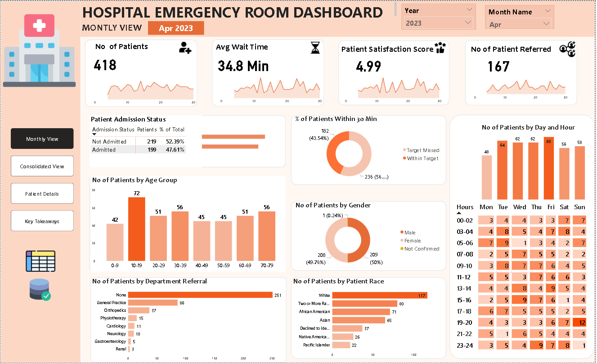
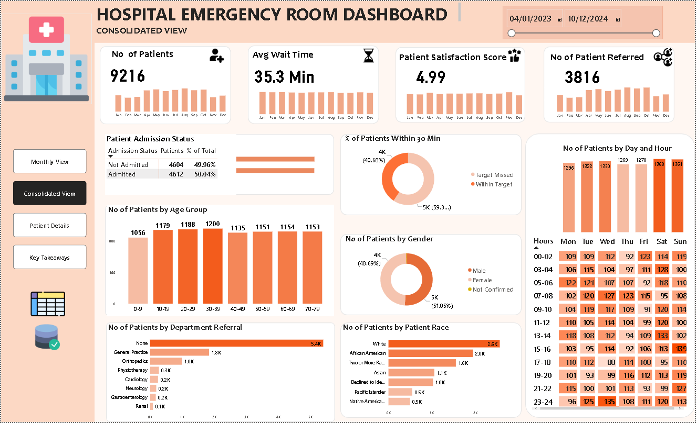
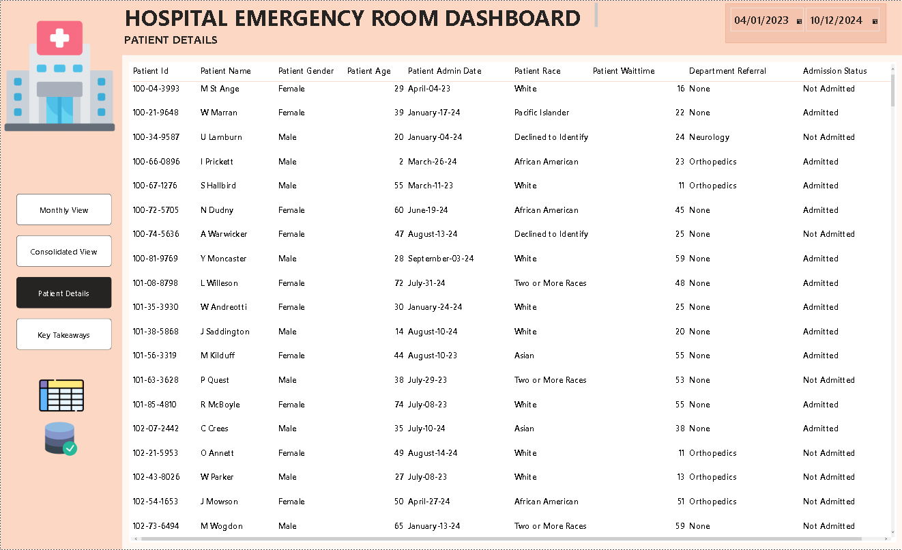
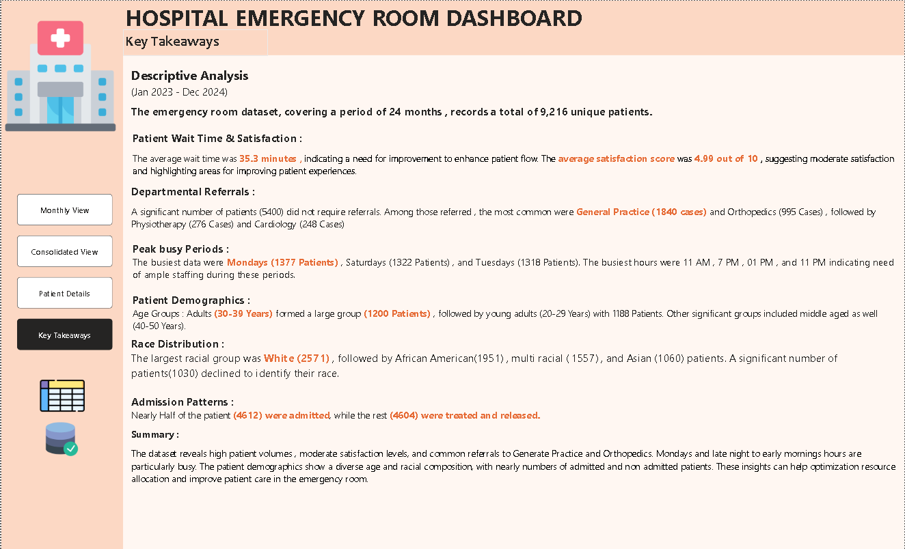

# Emergency Room Operations Dashboard (Power BI)

A complete, portfolio‑ready Power BI project that analyzes hospital ER operations end‑to‑end: **patient volumes, average wait time, satisfaction, demographics, referrals,** and a **time heatmap** to spot peak traffic. Built to demonstrate real business impact and solid BI engineering practices (Power Query ➜ Data Model ➜ DAX ➜ UX).

> **Files in this repo (as used below):**
> - `pbixHospital_ER_Dashboard.pbix`  *(Power BI file)*  
> - `Hospital ER_Data.csv`  *(synthetic sample data – safe for demo)*  
> - `monthly.png`, `consolidated.png`, `Details.png`, `takeaways.png`  *(screenshots)*

---

## 👀 Quick Preview

**Monthly View**


**Consolidated View**


**Patient Details**


**Key Takeaways**


---

## 🎯 What Problem Does This Solve?

Emergency departments struggle with **bottlenecks** and **uneven staffing**. Leaders need quick answers to:
- *When are we busiest?* (by hour & weekday)
- *Are we hitting the 30‑minute triage target?*
- *Which demographics and referrals drive demand?*
- *Is satisfaction moving with wait time?*

This dashboard turns raw visit data into **actionable intelligence** for **staffing**, **triage**, and **patient‑flow** decisions.

---

## 📊 Features at a Glance

- KPI cards: **# Patients**, **Avg Wait Time (min)**, **Satisfaction (0–10)**, **# Referred**
- **Peak hours × days** heatmap (operations planning)
- **Demographics**: age, gender, race
- **Department Referrals**: General Practice, Ortho, Physio, etc.
- **Admission vs Not Admitted** split
- **Patient Details** page for governed self‑service
- **Key Takeaways** page for exec‑ready narrative

> From the example screenshots: **Avg wait ≈ 35.3 min**, **Satisfaction ≈ 4.99/10**, busiest days **Mon/Sat/Tue**, busiest hours **11 AM / 1 PM / 7 PM / 11 PM**. (These will recompute on your own data.)

---

## 🏗️ Data Model (Semantic Layer)

**Tables**
- **Hospital ER_Data** *(fact)*: one row per visit (`Patient Id`, `Patient Name` (mock), `Patient Gender`, `Patient Age`, `Patient Race`, `Patient Admin Date`, `Admission Hour`, `Admission Status`, `Department Referral`, `Patient Waittime`, `Patient Satisfaction Score`, etc.)
- **Date** *(dimension)*: `Date`, `Month Name`, `Month Number`, `Month & Year`, `Day Name`, `Weekday`, etc.

**Relationships**
- `Date[Date]` → `Hospital ER_Data[Patient Admin Date]` *(single, directional)*

**Model practices used**
- Hide raw columns not needed in visuals
- Create a **Measures** table for all DAX
- Disable **Auto Date/Time**
- Sort labels (e.g., Month Name by Month Number)
- Use **numeric categories** (Age Groups, Wait Buckets) with static mappings

---

## ⚙️ Power Query (ETL) – key steps

1. **Data types**: cast dates, whole numbers, decimals correctly  
2. **Trim/clean**: remove extra spaces; uniform text casing  
3. **Derived columns**:  
   - `Admission Hour` (0–23) from timestamps  
   - `Age Group` (e.g., 0–9, 10–19, …, 70–79)  
   - `Race (Grouped)` (map rare values to “Other/Declined”)  
4. **Date table**: generate continuous calendar with `Month Name`, `Month & Year`, `Day Name`, `Weekday`, etc.  
5. **Keys**: ensure a stable `Patient Id` and unify date formats  
6. **Privacy**: replace all PII with **synthetic** or anonymized fields

> **Note:** `Hospital ER_Data.csv` here is **synthetic** for learning/demo purposes only.

---

## 🧮 DAX – measures & calculated columns

### Calculated Columns
```DAX
Wait Time Status = 
IF('Hospital ER_Data'[Patient Waittime] <= 30, "Within Target", "Target Missed")

Age Group =
VAR Age = 'Hospital ER_Data'[Patient Age]
RETURN
SWITCH(TRUE(),
    Age < 10, "0-9",
    Age < 20, "10-19",
    Age < 30, "20-29",
    Age < 40, "30-39",
    Age < 50, "40-49",
    Age < 60, "50-59",
    Age < 70, "60-69",
    "70-79"
)
```

### Core Measures
```DAX
Patients =
DISTINCTCOUNT('Hospital ER_Data'[Patient Id])

Avg Wait Time (min) =
AVERAGE('Hospital ER_Data'[Patient Waittime])

Satisfaction Score =
AVERAGE('Hospital ER_Data'[Patient Satisfaction Score])

Patients Referred =
CALCULATE( [Patients], 'Hospital ER_Data'[Department Referral] <> "None" )

Patients Within 30 =
CALCULATE( [Patients], 'Hospital ER_Data'[Patient Waittime] <= 30 )

% Within 30 =
DIVIDE( [Patients Within 30], [Patients] )

Admitted Patients =
CALCULATE( [Patients], 'Hospital ER_Data'[Admission Status] = "Admitted" )

Not Admitted Patients =
CALCULATE( [Patients], 'Hospital ER_Data'[Admission Status] <> "Admitted" )
```

### Time Intelligence (optional)
```DAX
Patients MTD = TOTALMTD( [Patients], 'Date'[Date] )
Avg Wait Time 3M Rolling =
AVERAGEX(
    DATESINPERIOD('Date'[Date], MAX('Date'[Date]), -3, MONTH),
    [Avg Wait Time (min)]
)
MoM Δ Patients =
VAR Prev = CALCULATE( [Patients], DATEADD('Date'[Date], -1, MONTH) )
RETURN [Patients] - Prev
```

---

## 🎨 UX & Accessibility

- Consistent **card → trend → breakdown** layout so leaders can scan quickly
- **Consolidated** vs **Monthly** tabs for exec summary vs deep‑dive
- Heatmap with numbers visible for quick read
- Sparklines in KPI cards for trend context
- Keyboard‑friendly navigation order; alt text for images; color choices with sufficient contrast

---

## 📈 Insights You Can Recreate

- **Peak demand windows** (hour × weekday) to align staffing
- **Variance to Target**: % patients within the 30‑minute triage goal
- **Referral mix** to coordinate downstream services
- **Demographic demand** to plan language/triage capabilities
- **Admission patterns** to anticipate bed capacity

---

## 🚀 How to Run This Project

1. Open **`pbixHospital_ER_Dashboard.pbix`** in **Power BI Desktop**.  
2. If prompted, point the query to `Hospital ER_Data.csv`.  
3. Click **Refresh**.  
4. Explore the **Consolidated**, **Monthly**, **Patient Details**, and **Key Takeaways** pages.  
5. Swap in your own data: make sure columns match the schema (see below).

**Minimal schema (columns)**
```
Patient Id (text or int)
Patient Name (text | synthetic)
Patient Gender (Male/Female/Not Confirmed)
Patient Age (number)
Patient Race (text)
Patient Admin Date (date)
Admission Hour (0-23)
Admission Status (Admitted/Not Admitted)
Department Referral (None/General Practice/Orthopedics/…)
Patient Waittime (minutes, number)
Patient Satisfaction Score (0-10)
```

---

## 🧪 Data Quality & Validation Checks

- Row count in **Consolidated** ≈ sum of **Monthly** after filters
- `Patients = Admitted + Not Admitted`
- `% Within 30` between 0–100%
- `Avg Wait Time` recomputes correctly with slicers
- Cardinalities: avoid high‑cardinality columns on slicers (e.g., raw names)

---

## ⚡ Performance Tips (if you extend this)

- Prefer **whole numbers** & short text categories
- Hide unused columns; mark key dimensions as **Date/Sort by**
- Turn off **Auto Date/Time**
- Use measures instead of calculated columns where feasible
- Keep visuals per page reasonable (< 12 heavy visuals)

---

## 🔒 Ethics & Privacy

This project uses **synthetic** data. If you adapt it with real hospital data:
- Remove direct identifiers (names, MRNs, addresses)
- Aggregate when sharing publicly
- Follow HIPAA/PHIPA‑style privacy practices and org policies

---

## 🗺️ Roadmap / Ideas

- **What‑If staffing** parameter to simulate impact on wait time
- **Queueing theory** metrics (utilization, Little’s Law approximation)
- **Anomaly detection** for unusual spikes (Python/R via Power BI)
- **Drill‑through** from heatmap → hour‑level trend diagnostics
- **Calculation groups** for fast time‑intelligence toggles

---

## 🙋 FAQ

**Q: My images don’t show in the README.**  
A: Make sure the file names match **exactly** (including `Details.png` capital D) and that the images sit in the repo root (or update paths).

**Q: Should I rename files?**  
A: Optional but cleaner: `Hospital_ER_Dashboard.pbix` and `Hospital_ER_Data.csv`. Update the README paths if you rename.

**Q: Can I use this in interviews?**  
A: Yes. It’s designed as a practical, ops‑focused example. Screenshots + PBIX included.

---

## 📬 Contact

**Nikhil Chandran** – Business & Data Analyst  
LinkedIn: https://www.linkedin.com/in/nikhilchandran/  
Email: nikhilchandran096@gmail.com

---

## 📝 License

Released under the **MIT License** – free to use, adapt, and share with attribution.

